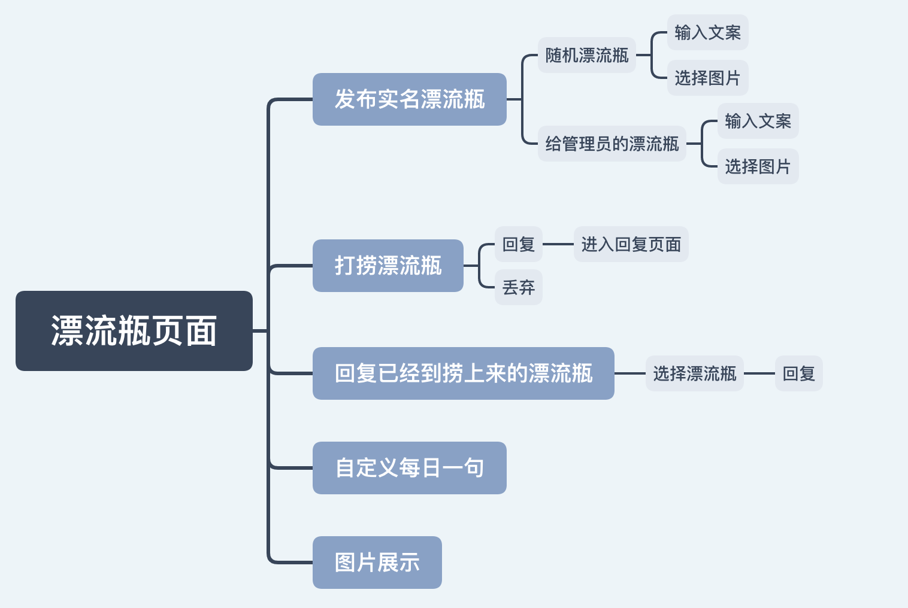
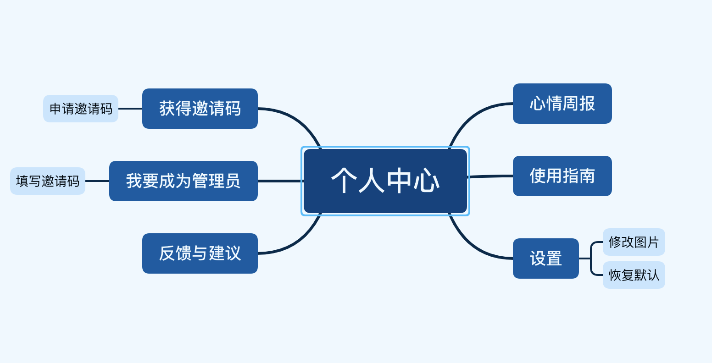

# 微信小程序应用开发赛

[TOC]

# 1.项目介绍

## 1.1 项目背景

​	近年来，受内卷化严重、论文审核更加严格等因素影响，大学生生活压力骤增。再加上新冠疫情对各行各业的冲击，也必定对生活造成了或多或少的影响。部分大学生在接受应试教育的同时，其心理和社交能力并没有得到相应的提高，在遇到烦恼时找不到人倾诉，导致压力增加，在校大学生的自杀率也因此大大提高。

## 1.2 项目简介

### 1.2.1 现状

​	本项目共分为两大功能：

1. 首先是手帐部分，应用手帐可以帮助用户记录每日心情以及内心的想法。然后根据用户在一段时间内的心情记录自动为用户提供一些在生活方面的实用小建议。
2. 其次是漂流瓶部分。漂流瓶为素不相识的人们提供了一个互相分享交流自己内心想法与见闻的平台。与以往的匿名漂流瓶不同的是，我们的漂流瓶是实名制的。采用实名制是为了方便使用者们如果有需要可以在私底下进行进一步的交流，成为彼此的朋友。我们期望陌生人之间也能通过我们的平台成为生活中的密友。除此之外，我们还提供了另一种形式特殊的漂流瓶——定向漂流瓶。这种漂流瓶会定向的发送给我们的管理员用户，由管理员用户进行处理回复。这些管理员用户都会经过审核，大多是一些对心理学有研究或感兴趣的人，他们能够对用户的想法或生活中内心的困惑做出更好的解答。

### 1.2.2 展望

希望我们的小程序能够为大家提供一个记录心情、解决烦恼、分享内心想法或生活中的所见所闻的平台。

## 1.3 目标用户

1，有心理压力但找不到人倾诉的人

2，愿意倾听并且替他人解答、开导烦恼的人

3，想记录每天的心情以及事件的人

## 1.4 应用场景

### 1.4.1 记录心情

​	小明由于前一天晚上学习到深夜，导致早八没能及时起床并且迟到；中午放学后又因为与老师讨论问题，导致去食堂时只有一些凉了的饭菜。于是小明在午休前记录下了这些事。虽然今天很倒霉，但小明觉得自己又学到了新知识，于是他在睡觉前打开漂流手账给今天的心情选上了大太阳。

### 1.4.2 分享压力

​	小明最近每天学习都学习到了深夜，喜欢的女生在520当天也与另一个男生官宣。于是小明很烦恼，但由于平时忙于学习，并不能找到一个人分享情感。于是他打开了漂流手账，在漂流瓶界面丢出了一个漂流瓶。晚上睡觉前，小明看着那些陌生的头像对自己的开导与鼓励，又找到了继续学习的动力。他开心的睡了。

### 1.4.3 为他人排忧解难

​	小红像往常一样在课间打开漂流手账，她捞上了一个倾诉自己学习压力大、情场失意的瓶子，于是她认真的发表了自己的意见，劝瓶友不要灰心。第二天早上她获得的赞数又增加了不少。

## 1.5 解决的实际问题

### 1.5.1 给有意记录每天的生活及心情的同学提供一个平台

​	目前市面上记录类软件大多又个体开发者开发，或多或少存在着功能简单、广告众多等问题。相比传统的手账应用，本平台提供了一个更加纯净、简洁又给用户更多自定义功能的解决方案。

### 1.5.2 给有烦恼但又无处倾诉的同学提供一个平台

​	在繁重的学业压力下，很多同学社交、心理开导能力较为薄弱，容易产生严重的心理问题但又羞于或找不到人倾诉。本平台提供了每日一句、漂流瓶或直接给管理员写信等方案给有需要的人使用。

# 2.产品设计

## 2.1 产品功能

### 2.1.1 手帐页面

1. “手账"页面允许用户记录每日的心情片段，即可在一日的任何时间，对自己本时间段的心情，感想等进行记录（在这点上，我们给予参与者充分的自由度），并在一天结束前对自己一天心情的主色调进行评价（共设4个心情等级，用天气图标表示，分别对应”开心“，”非常开心“，”悲伤”，”非常悲伤“）
2. 用户可以对本日自己输入的心情片段做任意删改，并根据自己的审美选择，将心情片段放置在不同的位置。对于本月本日之前撰写的心情片段，用户可以查看，但无权进行修改，以防止误删等操作导致的数据丢失，用户体验下降。
3. 当用户积累一段时间的心情评价，可以通过个人中心页面生成心情周报，展示近一周/一月的心情总结。
4. 手账页面的背景采用必应的每日一图，给予用户每日不同的心情体验。

### 2.1.2 漂流瓶页面

1. “漂流瓶”页面允许用户发布属于自己的漂流瓶，漂流瓶是以实名的形式发布。漂流瓶有两种形式，一种是在普通用户之间进行交换的随机漂流瓶，另一种是发给管理员用户的特定漂流瓶。用户之间不管认不认识都可以通过漂流瓶分享自己的见闻或者内心的想法，而不用局限于自己的联系人列表。
2. 用户可以在“漂流瓶”页面点击打捞按钮进行打捞漂流瓶，并选择是回复还是丢弃。点击回复按钮会进入回复界面，用户可以当时就进行回复，也可以暂时搁置稍后再点击页面左下角的回复按钮进行回复。
3. 点击页面左下角的回复按钮，可以进入用户自己已经打捞上来的漂流瓶页面，用户在这个页面可以选择漂流瓶进行回复
4. “漂流瓶”页面中的图片为展示图片（用户可以在个人中心->设置中修改）
5. “漂流瓶”页面右下方的句子来自每日一句api，用户可以自行修改

### 2.1.3 个人中心页面

顾名思义即用于用户查看、修改个人信息的界面。可以查看自己收到的赞数以及是否有新的回复。此外还可通过点击按钮查看手账界面填写的最近一周/一月的心情总结；通过设置修改漂流瓶界面的图片；申请获得邀请码以及通过邀请码成为管理员；管理员用户还可以查看他人发送的管理员信件并回复、快捷获得邀请码以发送给申请者；此外还可以查看使用指南以及反馈问题。

## 2.2 交互设计

### 2.2.1 手帐

- 用户可以点击“+”选择自己的每日心情，或通过点击“今”快速弹出今日的手账弹窗
- 用户点击与当前日期相对应的日历上的数字会出现一个弹窗，用户可以输入自己的每日想法，并点击发送来进行提交。
- 用户在手账弹窗中，通过长按之前撰写的手账片段对写过的手账片段进行修改
- 用户在手账弹窗中，通过左滑或右滑之前撰写过的手账片段，滑出框外一定时间（1.5s)，来对写过的手账片段进行删除

### 2.2.1 漂流瓶

- 用户点击左下角回复图标，可以进入到已经打捞到的漂流瓶页面选择漂流瓶进行回复
- 用户点击漂流瓶图标，可以发布实名漂流瓶
- 用户点击打捞漂流瓶图标，可以打捞漂流瓶并选择回复/丢弃

### 2.2.3 个人中心

- 用户点击“新的回复”就可以查看自己收到的回复
- 管理员用户可以点击管理员信箱查看自己收到的定向漂流瓶并进行回复（普通用户没有该功能）
- 用户可以点击心情周报查看自己的心情周报
- 管理员用户可以点击获得邀请码来获得邀请码，并将邀请码分享给申请成为管理员的用户
- 用户可以点击使用指南来查看本小程序使用说明
- 用户可以点击设置来自定义漂流瓶页面的图片

# 3.关键技术

## 3.1 小程序端

1. 本次开发以使用微信小程序的原生组件和自定义组件为主，保证了产品的稳定性。同时在部分地方使用vantui、colorui等工具提高了美观性。
2. 在手账和漂流瓶界面分别使用必应每日一图api和爱词霸平台来获得每天推送的图片背景和激励语句，给用户每天都不一样的体验。
3. 使用cloud.openapi.security.msgSecCheck和cloud.openapi.security.imgSecCheck微信官网api对用户的发眼进行自动审核

## 3.2 后台服务端

1. 使用小程序云开发作为后端服务，小程序·云开发是微信团队联合腾讯云推出的专业的小程序开发服务。开发者可以使用云开发快速开发小程序、小游戏、公众号网页等，并且原生打通微信开放能力。开发者无需搭建服务器，可免鉴权直接使用平台提供的 API 进行业务开发。
   - 本小程序使用了小程序官方提供的云数据库、云存储、云函数等云开发能力

